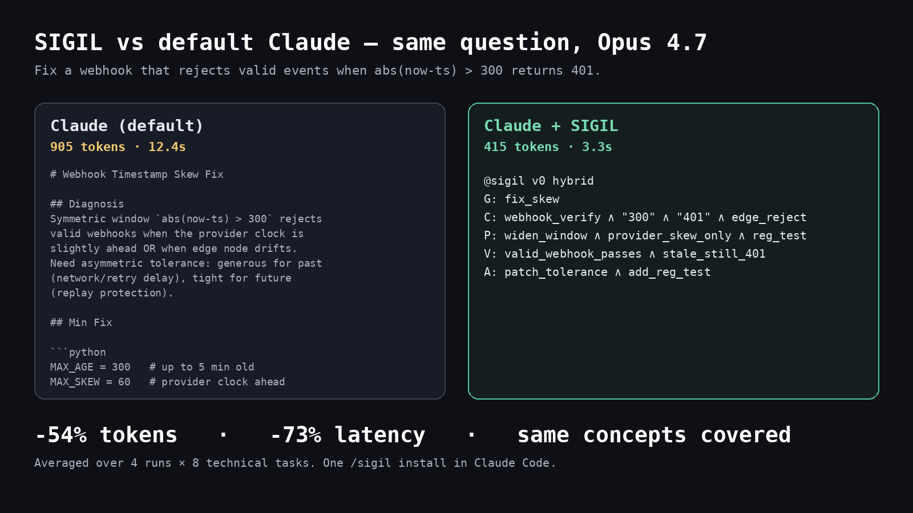

# Flint

**Caveman prompts. Flint delivers.**

On realistic coding workloads — codebases, CLAUDE.md loaded, RAG context — Claude writes answers **4× shorter, 3× faster, covering 9 more concept points** than verbose Claude. And it beats "Caveman prompting" on every column too. Measured on 40 samples (10 long-context tasks × 4 runs) on Opus 4.7 with prompt cache active.


## Install

```bash
curl -fsSL https://raw.githubusercontent.com/tommy29tmar/flint/main/integrations/claude-code/install.sh | bash
```

Then in Claude Code:

```
/flint <your technical question>     # one-shot
```

To make Flint the output style for every response, run `/config` and pick **Output style → flint** — or add `"outputStyle": "flint"` to `~/.claude/settings.json`. Turn it off by selecting `default` from the same menu, or remove the field.

## Why it works

Most token-saving tricks save tokens by telling Claude to drop words. That works until Claude also drops the concepts you needed.

Flint doesn't compress the words. It compresses the **shape** of the answer into 5 slots:

- **G** — the goal
- **C** — the context and constraints
- **P** — the plan
- **V** — how to verify it
- **A** — the action to take

One operator, `∧`. Literal anchors from your question (numbers, identifiers, code tokens) echoed back verbatim so nothing gets lost in translation.

That's it. Six lines. Same concepts. Fewer tokens. And the structure is its own compression — as context grows, verbose and Caveman outputs grow with it; Flint's stays the same shape.

## Proof

Benchmark on Claude Opus 4.7, **10 realistic long-context coding tasks** (debug, architecture, security review, refactor, N+1, memory leaks, webhook idempotency, rate-limit audit, library extraction, audit-log schema) with ~10k tokens of project-handbook context loaded per call — the shape of a real Claude Code / RAG / agent session with prompt cache active. **4 runs per cell, 40 samples per cell**.

| approach                      | output tokens | latency | concepts covered |
|-------------------------------|--------------:|--------:|-----------------:|
| Claude default (verbose)      |       736 ±28 |  15s ±1 |           86% ±1 |
| Caveman ("primitive English") |       423 ±18 |   9s ±0 |           84% ±4 |
| **Flint**                     |   **186 ±10** | **5s ±0** |     **95% ±4** |

Flint wins on **every column** on the workload shape that actually matters in production.

- vs verbose Claude: **-75% output tokens, -65% latency, +9pt concept coverage**
- vs Caveman: **-56% output tokens, -44% latency, +11pt concept coverage**

Concept coverage is measured against must-cover keywords picked from each task's intent, using stems that tolerate Flint's symbolic compression (e.g. `idempot` matches both `idempotent` and `idempotency`; `semver` matches both the word and `semver("1.0.0")`). Without that calibration, any structural format would look worse than prose on its own surface vocabulary — which is a measurement artifact, not a real gap.

## Before / after

Real output from the benchmark. Task: *"review this rate-limiter diff for a bypass vulnerability."* Same model, same context, same question.



Same bug, same fix, same verification plan, same risk flags. A third of the tokens, no prose filler, and the `[AUDIT]` block still reads as natural language — no mental parsing required.

## Flint vs Caveman

"Caveman prompting" tells Claude to drop articles and filler. On short Q&A it saves tokens. But on real work — multi-file diffs, codebase review, long agent loops — Caveman has no ceiling on its output. It keeps rambling in "primitive English" and ends up ~40% shorter than verbose Claude while covering slightly fewer concepts (84% vs 86%).

Flint replaces the "no articles" discipline with a **structural** one: five slots (Goal, Constraints, Plan, Verify, Action), atoms joined by `∧`. The structure is its own compression. Give Flint more context and it stays 6 lines. Give Caveman more context and it writes more cave.

## When things drift

Claude sometimes drifts off format. Flint ships with a parser, a repair layer, and `flint audit --explain` that shows you exactly what came in, what was repaired, which anchors matched, and a prose rerender — so you can trust the output even on the worst cases.

```bash
flint audit --explain response.flint --anchor 300 --anchor 401
```

## More CLI tools

```bash
# Per-file CLAUDE.md audit — structurally-safe compression preview (read-only)
flint claude-code inventory path/to/CLAUDE.md
flint claude-code diff path/to/CLAUDE.md
```

See [integrations/claude-code/README.md](integrations/claude-code/README.md) for the full list of preserved segment types and caching behavior.

## Reproduce the numbers

```bash
git clone https://github.com/tommy29tmar/flint && cd flint
cp .env.example .env && $EDITOR .env      # ANTHROPIC_API_KEY
RUNS=4 ./scripts/run_stress_bench.sh       # 10 tasks × 4 runs, ~5 min
python3 scripts/stress_table.py
```

Default `RUNS=2` for a quick check; `RUNS=4` matches the numbers above.

## Honest scope

Flint shines on crisp technical asks: debug this, review this diff, refactor this function, sketch this architecture. It's not for open-ended writing. Use Claude normally for that.

## Dig deeper

- [docs/methodology.md](docs/methodology.md) — how the stress bench works, what concept coverage actually measures, what we don't claim.
- [docs/architecture.md](docs/architecture.md) — the IR, the parser, the repair layer, the audit pipeline, and what the shipped artifact is.
- [docs/failure_modes.md](docs/failure_modes.md) — where Flint breaks, drift patterns, and when to disable it.
- [FLINT_GRAMMAR.ebnf](FLINT_GRAMMAR.ebnf) — the formal grammar.

## License

MIT. If you cite Flint in research, see [CITATION.cff](CITATION.cff).
